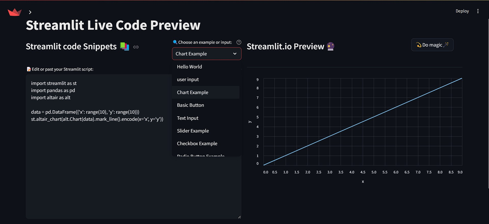
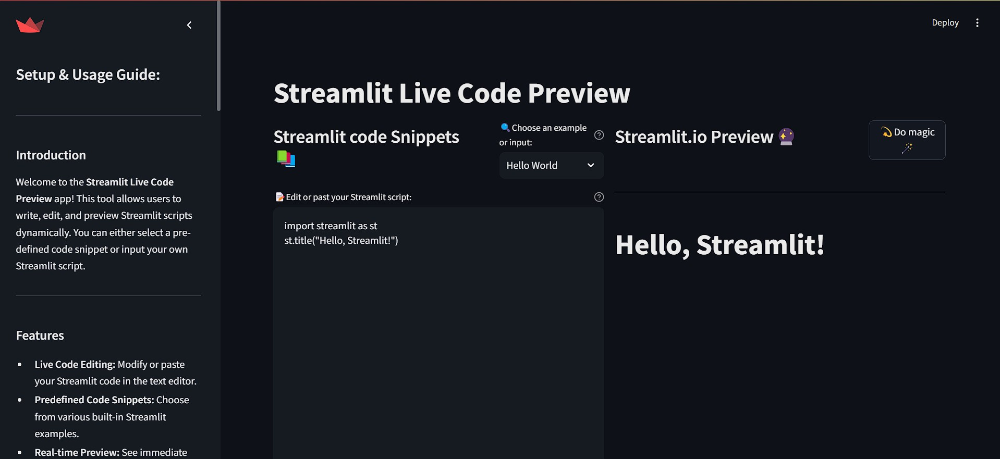

<a href="https://www.producthunt.com/posts/streamlit-preview?embed=true&utm_source=badge-featured&utm_medium=badge&utm_souce=badge-streamlit&#0045;preview" target="_blank"></a>

# streamlit-live-preview
Streamlit Live Code Preview is an interactive web-based tool that allows users to write, edit, and execute Python code dynamically within a Streamlit application. It is designed for real-time code execution, making it a powerful tool for learning, debugging, and experimenting with Streamlit scripts.


## Features
- **Live Code Editing**: Modify or paste your Streamlit code in a text editor.
- **Predefined Code Snippets**: Choose from a set of built-in Streamlit examples.
- **Real-time Preview**: Execute and view your script output instantly.
- **Error Handling**: Displays execution errors to help debugging.


## Installation
To run this project locally, follow these steps:

1. Clone this repository:
   ```sh
   git clone https://github.com/sahilkumardhala/streamlit-live-preview.git
   ```
2. Navigate into the project directory:
   ```sh
   cd streamlit-live-preview
   ```
3. Install required dependencies:
   ```sh
   pip install -r requirements.txt
   ```
4. Run the Streamlit app:
   ```sh
   streamlit run app.py
   ```

## Usage Guide
1. Select a predefined code snippet from the dropdown or enter your own Streamlit script.
2. Edit the code in the provided text area.
3. Click **"Do magic"** to execute and preview the script.
4. If any errors occur, they will be displayed below the preview panel.

## File Structure
```
streamlit-live-preview/
│-- app.py                 # Main Streamlit app file
│-- requirements.txt        # Required dependencies
│-- setup.md               # Instructions for setup & usage
│-- README.md              # Project documentation
│-- code_snippet.py        # Predefined Streamlit code snippets
│-- logo.jpg                # Project logo
│-- with_sidebar.jpg        # Project screenshot with sidebar
```

## Contributing
Contributions are welcome! If you'd like to improve this project, follow these steps:
1. Fork the repository.
2. Create a new feature branch.
3. Commit your changes.
4. Push your branch and create a pull request.

## License
This project is licensed under the MIT License. See `LICENSE` for details.

## Contact
For questions or suggestions, feel free to reach out:

- GitHub: [GitHub Profile](https://github.com/sahilkumardhala)

